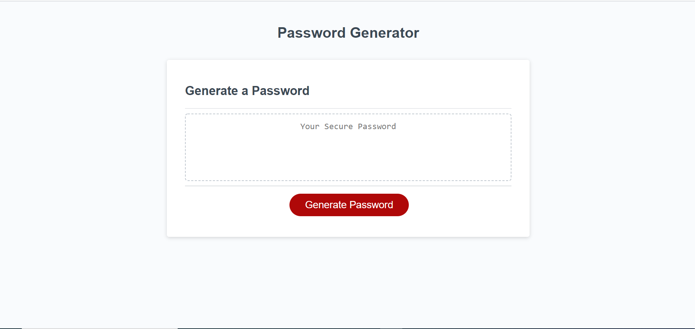

# Password-Generator

## Description 

This project practices array manipulation and iterations in JavaScript. The goal is to create a random password based on the types of inputs given by the user, including the use of special characters, numbers, and lower case letters. 

The code utlitizes while loops to keep prompting the user for inputs until the inputs from the user are "acceptable". The the code establishes the appropriate lengths to index each array. The Math.random() function is used to generate a random index within the bounds defined by the user, and then this process is iterated over the desired length of the password. 

## Table of Contents 

* [Installation](#installation)
* [Usage](#usage)
* [Credits](#credits)
* [License](#license)

## Installation

Here is the link to the webpage:

https://jgarcia60.github.io/password-generator/ 

To install the project files, you can clone the "password-generator" repository which contains the necessary JavaScript, html, and CSS files at https://github.com/jgarcia60/password-generator by clicking the green drop down "Code" and cloning the repo with an SSH key.  

## Usage 

You may use this code as your own password generator, or as a tool to help you understand array indexing and iterative loops.

This is what it looks like:

## Credits

All JS files, edits, additions, and revisions were done by Jonathan Garcia (https://github.com/jgarcia60/password-generator). 
The HTML and CSS files were provided by Trilogy Education Services, a 2U, Inc. brand.

## License

MIT License

Copyright (c) [2020] [Jonathan Garcia]

Permission is hereby granted, free of charge, to any person obtaining a copy
of this software and associated documentation files (the "Software"), to deal
in the Software without restriction, including without limitation the rights
to use, copy, modify, merge, publish, distribute, sublicense, and/or sell
copies of the Software, and to permit persons to whom the Software is
furnished to do so, subject to the following conditions:

The above copyright notice and this permission notice shall be included in all
copies or substantial portions of the Software.

THE SOFTWARE IS PROVIDED "AS IS", WITHOUT WARRANTY OF ANY KIND, EXPRESS OR
IMPLIED, INCLUDING BUT NOT LIMITED TO THE WARRANTIES OF MERCHANTABILITY,
FITNESS FOR A PARTICULAR PURPOSE AND NONINFRINGEMENT. IN NO EVENT SHALL THE
AUTHORS OR COPYRIGHT HOLDERS BE LIABLE FOR ANY CLAIM, DAMAGES OR OTHER
LIABILITY, WHETHER IN AN ACTION OF CONTRACT, TORT OR OTHERWISE, ARISING FROM,
OUT OF OR IN CONNECTION WITH THE SOFTWARE OR THE USE OR OTHER DEALINGS IN THE
SOFTWARE.

---